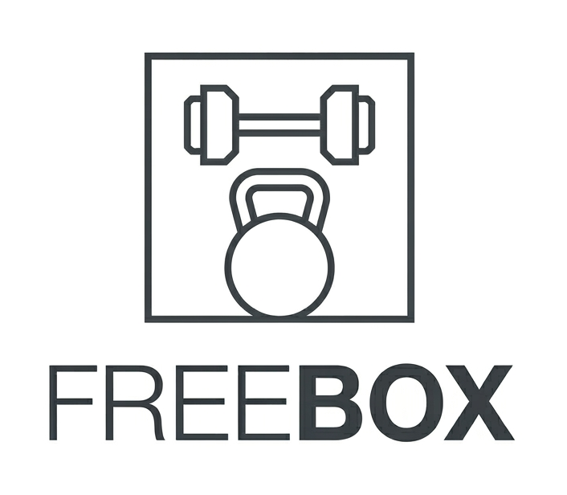
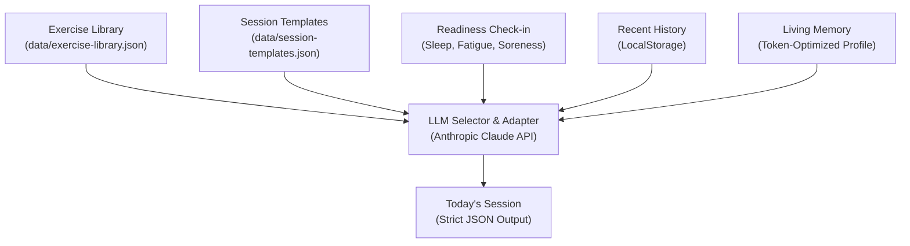

<p align="center">
  
</p>

# 📦 Freebox — Autoregulated Block Periodization & Context-Adaptive Training Engine

> **"Weniger, aber besser."** (Less, but better) — Dieter Rams. 
> Freebox is a premium, Braun-inspired training engine. It fuses strict sports science and block periodization with context-aware LLM adaptation, delivering daily, auto-regulated workouts tailored to your exact systemic readiness and real-world environment.

---

## ⚡ The Philosophy

Most AI fitness apps are built on flawed premises:
1. **Hallucinated Progressions**: LLMs left unrestricted generate structurally incoherent workouts, ignore fatigue accumulation, or suggest anatomically unsafe movements.
2. **Context Bloat**: Feeding months of raw workout logs into a prompt exhausts token limits, dilutes the LLM's attention, and degrades instruction adherence.
3. **The "Gamified Chat" Trap**: They act as chat interfaces or badge-delivery systems instead of executing a strict, scientifically validated athletic plan.

Freebox solves this by treating the LLM not as a creative generator, but as a **contextual adapter and constraint-resolution engine** working within rigid mathematical boundaries defined by exercise science.

---

## 🔬 The Sports Science Core

Freebox is not built on fitness trends; it is codified directly from peer-reviewed sports science. The engine translates academic research into a deterministic training system:

### 1. Block Periodization (Macrocyle Structure)
Instead of chaotic daily variation, Freebox organizes your training into specialized, sequential blocks to maximize target adaptation while managing systemic fatigue.
* **Foci**: Strength (neural drive), Hypertrophy (mechanical tension), Resistance (lactate tolerance & work density), and Explosive (Rate of Force Development - RFD).
* **Literature Foundation**:
  * **Bompa, T. O., & Buzzichelli, C. (2018).** *Periodization: Theory and Methodology of Training.* (Structuring developmental phases).
  * **Issurin, V. B. (2008).** *Block Periodization: Breakthrough in Sport Training.* (Validation of concentrated load blocks vs. traditional concurrent training).

### 2. Autoregulation & RIR (Volume Adaptation)
Rather than blindly forcing arbitrary loads, Freebox dynamically adjusts volume (total sets) based on daily systemic readiness (sleep quality, perceived energy, and muscle soreness), while preserving planned intensity (% 1RM).
* **Literature Foundation**:
  * **Helms, E. R., et al. (2016).** *Application of the Repetitions in Reserve-Based Rating of Perceived Exertion Scale for Resistance Training.* (Establishes RIR/RPE as a highly reliable tool for autoregulating intensity and volume).
  * **Selye, H. (1950).** *The Physiology and Pathology of Exposure to Stress.* (General Adaptation Syndrome - the framework for managing fatigue accumulation to avoid maladaptation).

### 3. Prilepin's Table (Neuromuscular Load Management)
The intensity and rep ranges for all primary lifts are governed by optimal volume zones originally analyzed by Soviet sports scientist A.S. Prilepin, ensuring maximum strength stimulus without overtaxing the Central Nervous System (CNS).
* **Literature Foundation**:
  * **Prilepin, A. S. (1974).** *Managing the Training of Weightlifters.* (The source code for matching intensity percentages to their optimal set and rep brackets).

### 4. Progressive Gymnastic Adaptations (Saturday Skills)
Saturday Calisthenics progressions utilize relative bodyweight strength scaling, systematically advancing motor patterns through progressive leverage adjustments rather than external loads.
* **Literature Foundation**:
  * **Low, S. (2016).** *Overcoming Gravity: A Systematic Approach to Gymnastics and Bodyweight Strength.*

---

## 📐 Architecture: The Three-Layer Engine

Freebox decouples sports science rules, structural periodization, and LLM reasoning into three distinct layers to ensure methodology integrity.



### 1. Curated Exercise Library (`data/exercise-library.json`)
The source of truth. Contains ~60 standard movements tagged with motor patterns, muscle groups, fatigue indices, and skill levels.
* **The Rule**: The LLM is restricted *exclusively* to this library. If the LLM returns an exercise ID not present in this static file, the runtime validator rejects the output instantly.

### 2. Scientific Session Templates (`data/session-templates.json`)
20 strict templates mapping **Cycle Phase** × **Day of the Week**.
* **The Rule**: The structural parameters—such as 3 sets of 3-5 reps at 85% 1RM for main lifts, movement order, and rest periods—are mathematically predefined by academic literature. The LLM has zero authority over structure; it only resolves the variables.

### 3. LLM Selector and Adapter (Claude 3.5 Sonnet)
Resolves the variables based on the athlete's daily reality:
* **Context Resolution**: Selects the exercise matching the template's required motor pattern (e.g. *Squat* → *Front Squat* if back-squatting occurred recently).
* **Readiness Auto-Regulation**: Modifies sets/reps dynamically based on the daily check-in (fatigue, sleep, muscle soreness).
* **Equipment Adaptation**: Drops exercises requiring equipment the athlete doesn't have access to.

---

## 🧠 Living Memory (Context-Distillation Architecture)

To keep context windows small and Anthropic API calls token-efficient, Freebox does not pass historical logs directly. Instead, it implements a **debrief-and-distill memory loop**:

1. **Cycle Tracking**: Workout logs are recorded locally.
2. **Weekly Synthesis**: At the end of an 11-week cycle, the user runs the **Cycle Debrief**.
3. **LLM Distillation**: Claude reviews the 11 weeks of logs and distills them into a 3-paragraph markdown summary stored in the athlete's profile (`UserProfile.longTermMemory`).
4. **Injection**: This profile-level memory is fed back into future workout generations, allowing the AI to maintain a persistent, multi-month awareness of the athlete's progression, limitations, and response to fatigue.

---

## 📱 Progressive Web App (PWA)

Freebox is designed as a native-feeling Progressive Web App. It bypasses the App Store/Google Play Store friction, making installation instant:
* **Offline Ready**: Registers a service worker to cache critical assets (`public/sw.js`).
* **Adaptive Icons**: Optimized manifest (`public/manifest.json`) featuring maskable icons (`icon-maskable-512.png`) tailored for Android.
* **Cold-Start Onboarding**: Elegant first-load screen that asks for athlete baseline metadata before initial workout generation.

---

## 🛠️ Tech Stack & Design System

* **Core**: Next.js 16 (Turbopack) & React 19.
* **Language**: TypeScript (strict schemas, zod-like validation for LLM outputs).
* **Styling**: Vanilla CSS utilizing a custom HSL-tailored dark system (Neutral dark `#F9F9FB` / `#09090B` base) inspired by Braun precision and Linear's interface.
* **Icons**: Curated Lucide React icons scaled to 1.2x (20% larger than default) for premium touch-targets on mobile.

---

## 🚀 Getting Started

### Local Development
1. Clone the repository:
   ```bash
   git clone https://github.com/fbattaglin/freebox.git
   cd freebox
   ```
2. Install dependencies:
   ```bash
   npm install
   ```
3. Set up environment variables:
   Create a `.env.local` file (already gitignored) and add your API key:
   ```env
   ANTHROPIC_API_KEY=your-api-key-here
   ```
4. Run the development server:
   ```bash
   npm run dev
   ```

### Deploying to Vercel
1. Push your repository to GitHub.
2. Import the repository in [Vercel](https://vercel.com).
3. Under Environment Variables, add `ANTHROPIC_API_KEY`.
4. Deploy. The platform will automatically optimize the Next.js static and serverless paths.
