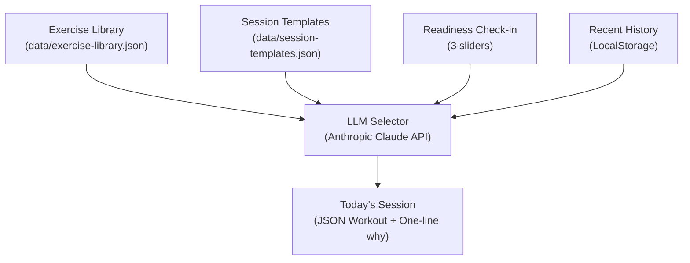

# Freebox — Architecture

Last updated: pre-MVP, foundation phase

This document describes the three-layer architecture of Freebox, the data schemas, the prompt construction strategy, the equipment scope tiers, and the folder structure.

---

## The Three-Layer Design

Freebox separates sports science rules, structural logic, and language model flexibility into three distinct layers to ensure safety, predictability, and methodology integrity.



### 1. Exercise Library (`data/exercise-library.json`)
Garante que nenhum exercício "fantasia" ou inventado seja retornado pelo LLM.
* **O que é:** Uma base estática e curada de ~60 exercícios. Cada um é detalhado com tags de padrão motor (squat, hinge, etc.), músculos primários/secundários, nível técnico de habilidade, custo de fadiga e equipamentos necessários.
* **Regra de ouro:** O LLM só pode selecionar itens presentes nesta biblioteca. Se o LLM sugerir qualquer exercício com ID fora deste arquivo, a requisição falha imediatamente na validação de runtime.

### 2. Session Templates (`data/session-templates.json`)
Garante a rigorosidade científica de cada sessão de treino.
* **O que é:** 20 templates estáticos pré-definidos que mapeiam cada cruzamento possível de **Fase do Ciclo $\times$ Dia da Semana**.
* **O que define:** Especifica os slots de treino (warmup, core activation, main work, cooldown), o volume de cada slot (sets), a intensidade recomendada (% 1RM ou faixa de reps), tempo de descanso e a ordem dos padrões de movimento.
* **Regra de ouro:** O LLM não tem permissão para decidir a estrutura do treino. Os parâmetros científicos (como 3x5 de agachamento na fase de força) são definidos no template por literatura acadêmica, e o LLM apenas preenche os slots vazios.

### 3. LLM Selector and Adapter (Anthropic Claude API)
Realiza a adaptação inteligente e a seleção contextual de forma determinística onde a estrutura exige e flexível onde o contexto dita.
* **O que faz:** 
  1. **Seleção:** Lê a estrutura do template do dia e escolhe os exercícios específicos da biblioteca que preenchem os requisitos de padrão motor de cada slot.
  2. **Coesão e Variedade:** Evita repetições musculares excessivas na mesma sessão (ex: impedir que o LLM selecione *front squat* e *leg press* na mesma sessão de forma repetitiva se a fadiga do quadríceps for um limitador).
  3. **Adaptação:** Lê o check-in de prontidão diária (*readiness*) do usuário. Se a prontidão estiver baixa, o LLM reduz o volume (sets) mantendo a intensidade (% 1RM), conforme preconiza a metodologia.
  4. **Comunicação:** Redige a justificativa científica de uma única frase ("por que esse treino hoje").

---

## Equipment Tiers (Escopo de Equipamentos)

O ecossistema do Freebox assume quatro níveis de disponibilidade de equipamento. Apenas os tiers **Essencial** e **Comum** são assumidos como padrões disponíveis no fluxo principal.

| Tier | Descrição / Disponibilidade | Equipamentos Permitidos |
| :--- | :--- | :--- |
| **Essencial** | Sempre em escopo. Assumido em qualquer academia. | Barra olímpica, anilhas, halteres, banco plano, banco inclinado, rack (squat rack), barra fixa, polia/cabo, peso corporal, kettlebell, caixa pliométrica. |
| **Comum** | Assumido presente na maioria das academias comerciais. | Leg press, máquina de chest press, máquina de remada, cadeira extensora, mesa flexora, smith machine, medicine ball, faixas elásticas (bands). |
| **Específico** | Opcional. Usado apenas como substituto secundário. | Hack squat, GHD, reverse hyper. *Nunca sugerido como principal.* |
| **Exótico** | Fora do escopo. Totalmente excluído do MVP e V1. | Trap bar, safety squat bar, atlas stones, sled/prowler, argolas, ginásticos avançados, equipamentos específicos de CrossFit. |

---

## Data Schemas (Formatos de Dados)

### Template Schema (`session-templates.json`)
Exemplo estrutural de um template para **Força - Segunda-feira (Lower)**:

```json
{
  "phase": "strength",
  "day": "Monday Lower",
  "slots": [
    {
      "type": "warmup",
      "duration_min": 8
    },
    {
      "type": "core_activation",
      "duration_min": 5
    },
    {
      "type": "primary",
      "pattern": "squat",
      "sets": 3,
      "reps": "3-5",
      "intensity_pct_1rm": "80-87%",
      "rest_min": 3
    },
    {
      "type": "secondary",
      "pattern": "hinge",
      "sets": 3,
      "reps": "5-8",
      "rest_min": 2.5
    },
    {
      "type": "accessory",
      "patterns": ["unilateral_lower", "core"],
      "sets": 3,
      "reps": "8-12",
      "rest_min": 1.5
    }
  ]
}
```

### Output Schema (Treino do Dia)
O formato JSON que o LLM selector retorna para a aplicação frontend:

```json
{
  "date": "2026-06-08",
  "phase": "strength",
  "day": "Monday Lower",
  "why": "sets of 3-5 reps at high intensity today will target neural adaptations, allowing you to build strength without excessive muscular fatigue.",
  "readiness_score": 75,
  "volume_modifier": 1.0,
  "exercises": [
    {
      "slot_type": "primary",
      "exercise_id": "back_squat",
      "name_pt": "Agachamento livre",
      "sets": 3,
      "reps": "3-5",
      "intensity_pct_1rm": "80-87%",
      "rest_min": 3,
      "cues": [
        "Braced core throughout",
        "Knees track over toes",
        "Depth at or below parallel"
      ]
    },
    {
      "slot_type": "secondary",
      "exercise_id": "romanian_deadlift",
      "name_pt": "Levantamento romeno",
      "sets": 3,
      "reps": "5-8",
      "rest_min": 2.5,
      "cues": [
        "Soft knees, don't lock out",
        "Bar scrapes legs on descent",
        "Hinge at the hip, not lower back"
      ]
    },
    {
      "slot_type": "accessory",
      "exercise_id": "bulgarian_split_squat",
      "name_pt": "Búlgaro",
      "sets": 3,
      "reps": "8-12",
      "rest_min": 1.5,
      "cues": [
        "Back foot relaxed on bench",
        "Front knee tracks over toes",
        "Drive through full foot"
      ]
    }
  ]
}
```

---

## Prompt Construction Strategy (Estratégia do Prompt)

O prompt enviado ao Claude API é construído dinamicamente agregando quatro partes fundamentais em tempo de execução:

1. **System Prompt Estático:** Codifica as regras comportamentais inegociáveis do LLM (tom técnico, Braun/Linear style, não inventar exercícios, obedecer à risca os tempos de descanso e padrões).
2. **Contexto do Banco (`library` + `template`):** O backend injeta o JSON correspondente ao template do dia e a biblioteca de exercícios filtrada pelos equipamentos do usuário (se configurado) e lateralidade.
3. **Dados de Prontidão (`readiness`):** O backend traduz o check-in do usuário em um modificador de volume (ex: Prontidão < 50 reduz os *sets* dos exercícios acessórios e secundários em 1).
4. **Histórico de Exercícios Recentes:** Passado para evitar repetições monótonas de exercícios secundários e acessórios de um treino para outro.

---

## Folder Structure (Estrutura de Pastas)

```
/
├── CLAUDE.md                   # Diretrizes gerais de desenvolvimento e constraints
├── docs/                       # Documentação técnica e de produto
│   ├── product-brief.md        # O "porquê" e o "o quê" do Freebox
│   ├── methodology.md          # A ciência codificada (ciclos, fases, matriz)
│   ├── identity.md             # Linha de design, tokens, tipografia e voz
│   └── architecture.md         # Três camadas, schemas e patterns (Este arquivo)
├── data/                       # Arquivos de dados (Fonte de Verdade)
│   ├── exercise-library.json   # Biblioteca curada com 63 exercícios
│   ├── session-templates.json  # 20 templates científicos de periodização
│   └── skills-library.json     # Biblioteca de habilidades para sábado
├── src/                        # Código fonte da aplicação Next.js
│   ├── app/                    # Next.js App Router (Páginas e APIs)
│   ├── components/             # Componentes de interface do Design System
│   ├── lib/                    # Lógica de cálculo de ciclos e acesso a dados
│   └── prompts/                # Arquivos de template de prompt para a API do Claude
```
